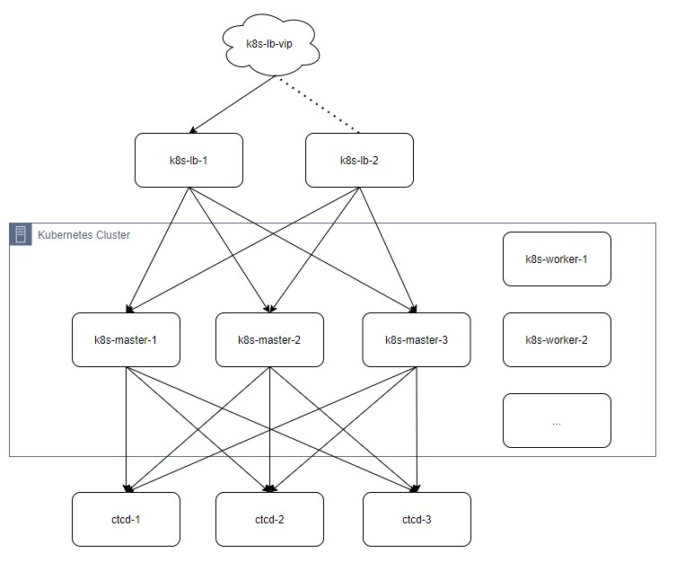

# kubernetes_ansible
Quickly deploy kubernetes high-availability cluster with ansible based on kubeadm tool

[简体中文](README_zh.md)

## Cluster architecture

### Preparation for nodes

- os: centos 7.x

Host Name|Role|Size|Software list
---|---|---|---
etcd-1|Etcd node 1|2C 1G|etcd
ectd-2|Etcd node 2|2C 1G|etcd
ectd-3|Etcd node 3|2C 1G|etcd
k8s-lb-1|Load balancer primary node|2C 0.5G|haproxy keepalived
k8s-lb-2|Load balancer backup node|2C 0.5G|haproxy keepalived
k8s-master-1| Control node 1|4C 2G|docker, kubelet, kubeadm, ipvsadm
k8s-master-2| Control node 2|4C 2G|docker, kubelet, kubeadm, ipvsadm
k8s-master-3| Control node 3|4C 2G|docker, kubelet, kubeadm, ipvsadm
k8s-worker-1| Work node 1|4C 8G| docker, kubelet, kubeadm, ipvsadm

In production environment, more backup nodes for LB and more work nodes can be added as per above table.

## Deployment

Make sure all the nodes can be sshed via root without password authentication.

Once the nodes have been provisioned. Manually modify the ip address in `00_set_local_hosts.yml` and `01_set-hosts.yml`. Ansible will help configure hosts files on local ansible host and target machines. If you have already added hostname and ip mapping into /etc/hosts on local ansible host, skip playbook `00_set_local_hosts.yml`