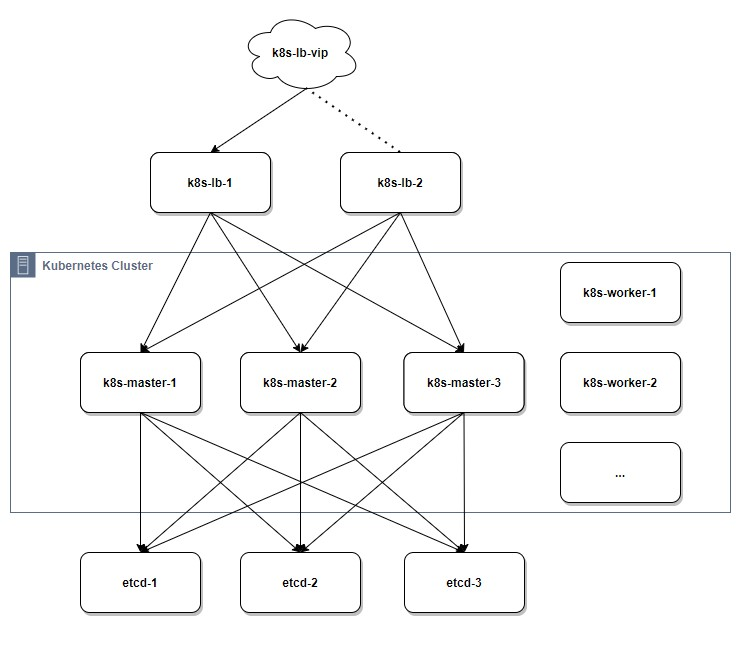

# kubernetes_ansible
基于 kubeadm 工具，用 Ansible 快速部署 Kubernetes 高可用集群

[English](README.md)

## Cluster architecture

### Preparation for nodes

Host Name|Role|Size|Software list
---|---|---|---
etcd-1|Etcd node 1|2C 1G|etcd
ectd-2|Etcd node 2|2C 1G|etcd
ectd-3|Etcd node 3|2C 1G|etcd
k8s-lb-1|Load balancer primary node|1C 0.5G|haproxy keepalived
k8s-lb-2|Load balancer backup node|1C 0.5G|haproxy keepalived
k8s-master-1| Control node 1|4C 2G|docker, kubelet, kubeadm, ipvsadm
k8s-master-2| Control node 2|4C 2G|docker, kubelet, kubeadm, ipvsadm
k8s-master-3| Control node 3|4C 2G|docker, kubelet, kubeadm, ipvsadm
k8s-worker-1| Work node 1|4C 8G| docker, kubelet, kubeadm, ipvsadm

在生产环境中，根据上表可以增加更多的LB备份节点和工作节点。

## Deployment

确保所有的节点都可以通过root被ssh连接，而不需要密码身份验证。

一旦提供了节点。手动修改“00_set_local_hosts”文件中的ip地址。yml”和“01 _set-hosts.yml”。Ansible将帮助配置本地Ansible主机和目标机器上的主机文件。如果您已经将主机名和ip映射添加到本地ansible主机的/etc/hosts中，请跳过playbook ' 00_set_local_hosts.yml '